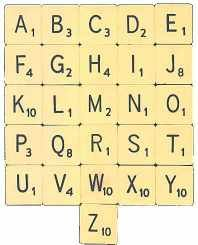




 


{{ titre_chapitre(num,titre,theme,niveau)}}
 
## Activités 

{{ titre_activite("Format csv",[],0) }}

1. Consulter le site [data.gouv.fr](https://data.gouv.fr/){target=_blank} et notamment sa [page de documentation](https://doc.data.gouv.fr/){target=_blank}. Quels sont les objectifs de ce site ?
2. Consulter cette [page](https://www.data.gouv.fr/fr/datasets/menus-des-cantines-des-colleges/) du site `data.gouv.fr`. Quelles données peut-on télécharger sur cette page ? Sous quelle forme sont-elles proposées ?
3. Prévisualiser les données au format `csv`. Faites des recherches sur ce format de données.
4. Expliquer rapidement comment sont représentées des données au format `csv`


{{ titre_activite("De nouveaux outils en Python",["notebook"]) }}

Pour traiter des données en tables représentées sous forme de fichiers `csv`, on utilise de nouvelles fonctionnalités de Python à découvrir dans les Notebook suivants :

1. La manipulation de fichiers en Python :

    * Option 1 : {{ telecharger("Sur les fichiers","./notebook/Fichiers.ipynb")}}
    * Option 2 : {{ capytale("240f-1041131")}}

2. Les dictionnaires en Python :

    * Option 1 : {{ telecharger("Sur les dictionnaires","./notebook/Dictionnaires.ipynb")}}
    * Option 2 : {{ capytale("5deb-1041138")}}

{{ titre_activite("Lecture et traitement",["notebook"]) }}

* Option 1 : {{ telecharger("Données en table avec Python","./notebook/MenuCantine.ipynb")}}
* Option 2 : {{ capytale("d891-1041156") }} 

{{ titre_activite("Tri d'une table",[]) }}

Le fichier [Médailles Tokyo 2021](./files/C7/Tokyo2021.csv) présente au format `csv` le tableau des médailles des jeux olympiques de Tokyo 2021.

1. Quelques révisions
    1. Télécharger ce fichier et l'ouvrir pour en avoir un aperçu, quels sont les descripteurs de ce fichier `csv` ?
    2. Comment sont classés les pays ?
    3. Recopier et compléter le programme Python suivant qui permet (à l'aide du module `csv`) de lire ce fichier sous la forme d'une liste de dictionnaires dont les clés sont les descripteurs.

        ```python3
        import csv
        # Attention : préciser éventuellement le chemin d'accès complet du fichier
        fichier_medailles=open(.......,"r",encoding="utf-8")
        # Lecture sous forme de dictionnaire 
        medailles = list(csv.DictReader(...........,delimiter=','))
        fichier_medailles......()
        ```

    4. Que contient la variable `medailles[0]["Total"]` ? 
    5. De quel type est cette variable ?

        !!! Warning "A retenir (source de bugs)"
            Même une quantité numérique lue à partir d'un fichier   `csv` est une chaine de caractère pour Python. Penser à convertir en type numérique (`int` ou `float` avant d'effectuer comparaisons et tris)

2. On souhaite lister les pays par nombre total de médailles (et pas par nombre de médaille d'or). On doit donc trier la liste de dictionnaire avec le critère de la clé `Total`. Pour cela :

    1. créer une fonction qui renvoie la valeur associée à la clé `Total` :
    ```python
    def total_medailles(pays):
        return int(pays["Total"])
    ```
    2. utiliser la fonction `sorted` de python en précisant que cette fonction est la **clé** (`key`) de tri 
    ```python
    medailles_par_total = sorted(medailles,key = total_medailles)
    ```
    3. Afficher les cinq premières lignes du nouveau dictionnaire `medailles_par_total`, le résultat est-il celui attendu ? Quel est le problème ?

    4. Afficher (ou rechercher) l'aide sur la fonction `sorted` de Python, en déduire comment effectuer un tri par ordre décroissant.

3. On décide d'effectuer un classement par points, en attribuant 10 points à une médaille d'or, 4 à une médaille d'argent et 1 à une médaille de bronze. 
    1. Ecrire le programme Python permettant d'effectuer ce classement.
    2. Donner la liste  des 10 premiers pays avec ce nouveau classement.


## Cours

{{ aff_cours(num) }}


## QCM

{{qcm_chapitre(num)}} 


## Exercices

{{ exo("Manipulation de fichiers en Python",["python"],0)}}

1. Recopier et compléter le tableau suivant :

    | Nom du fichier | Descripteur | Mode     | Ouverture | Fermeture |
    |----------------|-------------|----------|-----------|-----------|
    |`eleves.txt`    | `fic`       |lecture   |           |           |
    |                |             |          | `d = open("dates.txt","a")`           |           |
    |`couleurs.txt`  |             |écriture  |           |`fic.close()`           |
    |`data.txt`      | `data`      |ajout     |           |           |
    |                |             |          | `exos = open("exos.txt","r")`           |           |

2. Quel instruction Python permet d'écrire dans un fichier un passage à la ligne ?
3. Que se passe-t-il si on ouvre un fichier déjà existant en mode écriture ?
4. Quelle instruction doit-on toujours trouver après une instruction `open` ?

{{ exo("Nombre de lignes d'un fichier",["python"])}}

Ecrire une fonction qui prend en paramètre un nom de fichier et retourne le nombre de lignes de ce fichier.

{{ exo("Recherche dans un dictionnaire",["python","dur"])}}

Pour cette exercice on utilise le dictionnaire téléchargeable ci-dessous:
{{ telecharger("Dictionnaire","./files/Projets/cesar/dictionnaire.txt")}}

1. Combien il y a-t-il de mots dans ce dictionnaire ?
2. Lister tous les mots de 17 lettres de ce dictionnaire.
3. Quel est le plus grand mot de ce dictionnaire ?
4. Lister tous les mots de 5 lettres qui ont un *d* en deuxième position et se terminent par un *e*.
5. Lister tous les mots palindromes de ce dictionnaire (un mot palindrome est un mot pouvant se lire indifféremment dans les deux sens par exemple *kayak* ou *été*)

{{ exo("Créer et manipuler un dictionnaire",["python"])}}

On suppose qu'on a crée un dictionnaire `conversion` dont les clés sont les chiffres (de 0 à 9) et les valeurs leur écriture en lettre. Par exemple `conversion[3] = "trois"`.

1. Ecrire une instruction Python permettant de créer ce dictionnaire
2. Ajouter la clé `10` à ce dictionnaire avec pour valeur `"dix"`
3. Modifier ce dictionnaire pour que la clé `1` corresponde à `"one"`
4. Ecrire une boucle `for` permettant de parcourir les clés de ce dictionnaire.

{{ exo("De l'utilité des dictionnaires",["python"])}}

Au jeu du Scrabble, chaque lettre a une valeur comme indiqué sur l'image ci-dessous :

{.imgcentre width=300px}

Le but de l'exercice est d'écrire une fonction `score` qui prend un argument un `mot` et renvoie la somme des valeurs des lettres de ce mot. Par exemple `valeur("GIRAFE")` doit renvoyer 10 en effet :
{.imgcentre width=250px}
et donc la valeur est $2+1+1+1+4+1 = 10$

1. Compléter  une première version de `score` qui parcours les lettres du mots et ajoute la valeur suivant la lettre rencontrée.
```python
def score(mot):
    total = 0
    for lettre in ....:
        if lettre == 'A' or lettre=='E' or lettre=='I' ..... :
            total += 1
        if lettre == 'D' or lettre == 'G' or .......:
            totel += 2
        ...
        ...
    return ...
```


2. Les dictionnaires à la rescousse

    1. Créer un dictionnaire `valeur` dont les clés sont les lettres de l'alphabet et qui associe à chaque lettre sa valeur.

    2. Utiliser ce dictionnaire afin d'écrire une version bien plus courte et lisible de la fonction `score`.

{{ exo("Fichier `csv`",[])}}
1. Corriger le fichier `pays.csv` ci-dessous afin qu'il soit correct :
```csv
Nom;Capitale;Surface(km2);Population(M)
France;Paris;551695,67
Allemagne;Berlin;83
Espagne;505992;47
```
2. Le programme Python suivant permet d'ouvrir ce fichier et de créer la liste de dictionnaires `pays`, corriger les erreurs commises à la ligne 2 :
```python linenums="1"
import csv
fichier_pays.open("pays.csv","read")
pays = list(csv.Dictreader(fichier_pays,delimiter=";")
fichier_pays.close()
```
3. Dans le programme précédent, on a supposé que le séparateur de champ est `;`, quelle modification faut-il apporter à ce programme si le séparateur de champ est `,` ?
4. Dans le programme précédent, on a supposé que l'encodage était {{ sc("utf-8")}}, quelle modification faut-il apporter à ce programme pour lire un fichier dont l'encodage serait par exemple {{ sc("ascii")}} ?

{{ exo("Personnages célèbres de l'histoire de l'informatique",[]) }}
On reprend l'exemple de fichier `csv` d'informaticiens célèbres vu en cours :
```csv
Nom;Prénom;Naissance
Pascal;Blaise;1623
Lovelace;Ada;1815
Boole;George;1815
```

1. Faire une copie de fichier sous le nom `informaticiens.txt`
2. Ajouter les descripteurs suivant `décès` (pour l'année de la mort), `nationalité`, `sexe` et `contribution`. Ce dernier champ contient les contributions du personnage à l'histoire de l'informatique. 
3. Faire des recherches sur le *Web* afin de pouvoir compléter ces champs pour chacun des trois personnages ci-dessus

    !!! aide 
        Pour Blaise Pascal, on peut par exemple écrire *"Invention de la première machine à calculer"* dans le champ `contribution`.

4. Ajouter un enregistrement de votre choix à ce fichier `csv`.
5. Ecrire un programme Python permettant de lire ce fichier `csv` et de créer la liste de dictionnaires `celebres`.
6. Trier ce dictionnaire par date de naissance.


{{ exo("Pays du monde",[]) }}
En cliquant sur le lien ci-dessous, télécharger un fichier au format `csv` (source : [kaggle.com](https://www.kaggle.com){target=_blank}, licence : domaine public), contenant des informations sur les pays du monde :
{{ telecharger("Pays du monde","./files/C7/countries.csv")}}
On précise la signification des champs suivants : <br>
:octicons-triangle-right-16: `Population` : le nombre d'habitants du pays,<br>
:octicons-triangle-right-16:`Region`: la région dans laquelle se trouve le pays, par exemple la France est dans la région {{ sc("western europe")}},<br>
:octicons-triangle-right-16: `Area` : la surface du pays en *miles* carrés,<br>
 :octicons-triangle-right-16:`Coastline` : la surface cotière du pays, cette surface vaut "0,00" lorsque le pays n'a pas d'ouverture sur la mer, <br>
:octicons-triangle-right-16:  `GDP` : le produit intérieur brut par habitant, c'est une mesure de la richesse du pays. <br>

1. Ecrire un programme Python permettant de lire ce fichier et de créer la liste de dictionnaires `pays`.
2. Compléter votre programme en rajoutant les instructions permettant d'afficher :
    1. la population, la surface et le produit intérieur brut de la France,
    2. le nom des toutes les régions figurant dans cette table,
    3. la liste des trois pays les plus peuplés au monde,
    4. le plus grand pays n'ayant pas d'ouverture sur la mer.
3. Ecrire une fonction Python permettant de convertir les *miles* carrés en kilomètres carrés.
4. Donner la liste pays dont la surface est comprise en 500 000 et un million de kilomètres carrés.


{{ exo("Statistiques des prénoms donnés en France",[]) }}
Le but de l'exercice est de réutiliser un fichier de données du site [data.gouv.fr](https://data.gouv.fr) pour en extraire des informations. Il s'agit des prénoms donnés en France entre 1900 et 2019.

1. Télécharger le fichier à partir de l'adresse suivante : [fichier des prénoms](https://www.data.gouv.fr/fr/datasets/ficher-des-prenoms-de-1900-a-2019/){target=_blank}
2. Ce fichier peut-il être ouvert avec un tableur ? Pourquoi ?
3. Ecrire un programme Python permettant de lire ce fichier et de créer la liste de dictionnaires `prenoms`.

    !!! Aide 
        * le délimiteur de champ est le point-virgule `;`

4. Donner la liste des descripteurs de ce fichier et leur signification.
5. Recherche le nombre de fois où votre prénom à été attribué dans votre département l'année de votre naissance.
6. Quels ont été les trois prénoms les plus attribués à la Réunion en 2000 ?
7. Le prénom Dominique est mixte, en 2000 donner le nombre de personnes de chacun des deux sexes portant ce prénom.
8. Rechercher les prénoms rares (attribués moins de 4 fois) à la Réunion en 2005.

## Humour d'informaticien


{: .imgcentre width=500px}