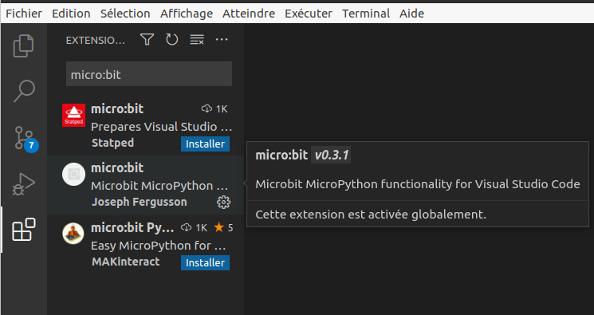




 

{{ titre_chapitre(num,titre,theme,niveau)}}

!!! important
    Pour la mise en oeuvre de ce chapitre, on utilise la carte [micro:bit](https://microbit.org/){target=_blank}. On ne présente ici que quelques fonctionnalités de base, [la documentation complète de la carte](https://microbit-micropython.readthedocs.io/fr/latest/index.html){target=_blank} est disponible sur le *Web*.

## Activités 

{{ titre_activite("Capteurs et actionneurs",[],0) }}

{! .centre}

1. Sachant que les **capteurs** sont les éléments permettant de collecter des informations provenant de l'environnement et que les **actionneurs** sont les éléments permettant d'agir dans le monde réel (production d'affichages, sons, vibrations, ...) identifier les capteurs et les actionneurs d'une carte micro:bit.

    !!! aide
        Voir [cette page de documentation](https://microbit.org/fr/get-started/user-guide/overview/){target=_blank}. Attention, deux types de cartes sont présentées, celles utilisées dans ce cours sont les **Micro:bit original**.

2. La nouvelle carte **Micro:bit** possède un micro, est-ce un capteur ou un actionneur ?

3. Ce micro est équipé d'une {{sc("led")}} qui s'allume lorsque le micro est activé, est-ce un capteur ou un actionneur ?

{{ titre_activite("Premier programme avec une carte Microbit",[]) }} 

L'idéal est bien sûr, est de disposer d'une carte, dans le cas contraire un [emulateur en ligne](https://create.withcode.uk/) est disponible. En classe, des cartes vous seront prêtées  et on utilisera l'éditeur VS code avec lequel nous sommes déjà familiarisés, mais qui doit être configuré pour fonctionner avec la carte. 

1. Configuration de VS Code
    1. Dans l'onglet extension rechercher `micro:bit` et installer `micro:bit` (par Joseph Fergusson).
        {: .centre}
    2. Ouvrir un dossier de travail, puis dans le menu affichage sélectionner `Palette de commandes` et taper `micro`. Dans la liste de commandes qui apparaît, sélectionner `Fetch micro:bit modules`.
    3. Créer un fichier portant l'extension `.py` en haut et à droite de la fenêtre de l'éditeur la commande `Build current file to Micro:Bit` vous permettra maintenant de transférer votre programme.

        !!! note
            Pour une utilisation à la maison, si vous disposez d'une carte Microbit, il faut aussi installer [uflash](https://pypi.org/project/uflash/){target=_blank} avec la commande `pip install uflash`. Cela est déjà fait sur les ordinateurs du lycée.

2. Premier programme
    1. Connecter votre carte Microbit à votre ordinateur par un port {{sc("usb")}}
    2. Copier et sauver le programme suivant dans VS Code :
        {{ code_insert(niveau,num,"microbit1.py",2)}}

    3. Sélectionner `Build current file to Micro:Bit`. La diode lumineuse située à l'arrière de l'appareil devrait clignoter pour indiquer que le transfert du programme vers la carte est en cours. Ensuite, elle devrait afficher l'image d'un sourire et faire défiler le message "Salut !". 

    !!! note
        Pour une liste complète des images prédéfinies consulter cette [page](https://microbit-micropython.readthedocs.io/fr/latest/tutorials/images.html){target=_blank}
        
{{ titre_activite("Utilisation des boutons",[]) }} 

On souhaite programmer la carte pour qu'elle affiche un compteur, le numéro affiché augmente avec un appui sur le bouton B et diminue avec un appui sur bouton B. C'est le principe de l'affichage des numéros des clients qui sont servis dans un commerce où le client récupère un ticket indiquant son ordre de passage à l'entrée.

1. Recopier, compléter et tester le programme suivant :
{{ code_insert(niveau,num,"microbit2.py",1)}}
2. Expliquer l'utilisation de `str` ligne 4   
3. Quel est le but de la boucle while à la ligne 3 ?

    !!! aide
        On remarquera l'utilisation de `was_pressed()` (et pas `is_pressed()`) pour les boutons.

4. On suppose que les numéros des tickets des clients reviennent à zéro dès qu'ils dépassent 10. Modifier le programme en conséquence, c'est à dire qu'un appui sur le bouton B fera passer le compteur à 1 s'il était à 10. 

## Cours

{{ aff_cours(num) }}

## QCM

{{qcm_chapitre(num)}}

## Exercices

{{ exo("Utilisation de l'acceleromètre",[],0) }}

1. Recopier et tester le programme suivant :
{{ code_insert(niveau,num,"de.py")}} 
2. Quel est le rôle de ce programme ?  
3. Modifier ce programme afin qu'il affiche au hasard l'une des 26 lettres de l'alphabet lorsque la carte est orientée face vers le haut.

!!! aide
    * On pourra utiliser la fonction `chr` de Python, on rappelle que le code de A est 65.
    * La liste des gestes détectées par la carte (secouer, orienter ...) est disponible sur [cette page](https://microbit-micropython.readthedocs.io/fr/latest/tutorials/gestures.html?highlight=shake){target=_blank}

{{ exo("Affichage pixel par pixel",[]) }}

Les 25 diodes situés sur la carte peuvent être activées individuellement et avec un niveau d'intensité variable grâce à l'instruction : `display.set_pixel(x,y,lum)` où `x` est la colonne du pixel (de 0 celle de gauche à 4 celle de droite), `y` est la ligne du pixel (de 0 en haut à 4 en bas) et `lum` l'intensité lumineuse (de 0 éteint à 9 luminosité maximale). 

1. Ecrire un programme permettant de reproduire l'affichage ci-dessous :
{: .centre}
2. Programmer la carte pour qu'on puisse déplacer à l'aide des boutons A et B un pixel situé sur la ligne 4. Le bouton A déplace le pixel à gauche (et il est bloqué en atteignant la colonne 0) et le bouton B le déplace vers la droite (il est bloqué en atteignant le dernière colonne)

{{ exo("Un retour sur la dichotomie",[]) }}

*Exercice d'après une idée de M.Coilhac*.

On pense à un nombre compris entre 1 et 1000 et la carte Micro:bit doit trouver ce nombre. A la première étape la carte propose `500` car `(0+1000)//2=500`. 

* Si votre nombre est strictement plus petit, vous appuyez sur A.
* Si votre nombre est strictement plus grand, vous appuyez sur B.
* Sinon (c'est votre nombre) et vous appuyez sur A et B simultanément. La carte affiche alors un `Image.SMILE`.

Le processus se répète aux étapes suivantes en utilisant l'algorithme de recherche par dichotomie.

{{ exo("Quelques idées de mini-projets",[]) }}

1. Un jeu de mémoire dans lequel la carte affiche une liste d'images (chacune environ 1 secondes). Ensuite, la carte affiche une image fixe et vous devez indiquer si cette image était ou non dans celles affichées au début.
2. Un jeu pierre-feuille-ciseaux
3. Un jeu de mesure du temps de réaction.

!!! Lien "Pour aller plus loin"
    Pour aller plus loin avec la carte micro:bit et pour des idées de projets, on pourra par exemple consulter les sites suivants :

    * [Le site officiel de la carte](https://microbit.org/projects/make-it-code-it/){target=_blank}
    * [Site d'Oliver Lecluse](https://www.lecluse.fr/info/microbit/){target=_blank}
    * [qkzk](https://qkzk.xyz/docs/nsi/cours_premiere/projets/bbc_microbit/introduction/){target=_blank}