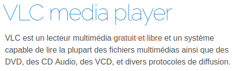
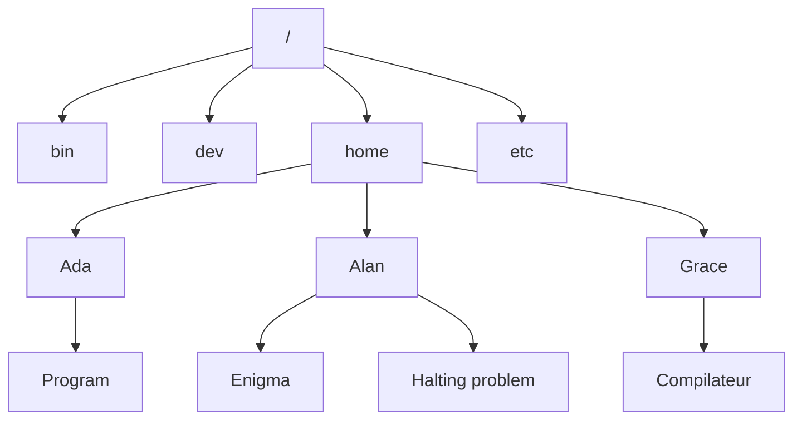




 


{{ titre_chapitre(num,titre,theme,niveau)}}

## Activités 

{{ titre_activite("Découverte des OS, logiciels libres",[],0) }}
 

1. Rendez-vous sur la  [page de téléchargement du logiciel vlc](https://www.videolan.org/vlc/index.fr.html){target=_blank}. :
    * Pourquoi faut-il télécharger une version différente de VLC suivant qu'on utilise Windows, MacOS, Linux ou Android ?
    * Pouvez-vous associer chaque icône au logiciel qu'il représente ?  
    {.imgcentre}
2. En faisant  des recherches sur le *Web*, rédiger une réponse brève aux questions suivantes :
    * Que sont Windows, MacOS, Linux et Android ?
    * Quel est le rôle de ces logiciels sur un ordinateur ?
    * Que signifient les mot **libre** et **gratuit** dans la phrase : "*VLC est un lecteur multimédia gratuit et libre*" ?  
    {.imgcentre}

{{ titre_activite("Initiation à la ligne de commande",[])}}

Cette initiation se fait à travers la réalisation de **missions** dans un mini jeu d'aventures appelé [gameshell](https://github.com/phyver/GameShell){target=_blank}. 


1. Installation de Gameshell :
    1. Télécharger le fichier [gameshell](./files/C1/gameshell.sh).
    2. Ouvrir l'explorateur de fichier.
    3. Créer un répertoire `gameshell` dans votre dossier personnel
    4. Dans ce répertoire, copier le fichier gameshell que vous avez téléchargé.
    4. Faire un clic droit sur le fichier et dans l'onglet permission cocher la case '*Autoriser l'exécution du fichier comme un programme*', comme illustré ci-dessous : {: .imgcentre}
    5. Faire un clic droit dans la fenêtre de l'explorateur de fichier et sélectionner "*ouvrir dans un terminal*" comme illustré ci-dessous :{: .imgcentre}
    6. Dans le terminal taper :
    ```bash
     ./gameshell.sh 
    ```

2. Parallèlement à l'exécution des missions :
    * Noter les commandes que vous utilisez et leur signification
    * Tenir à jour un plan du monde dans lequel se déroule le jeu
    
    !!! aide "Aide"
        Pour la première mission, vous devez donc noter le sens des commandes `cd`, `ls` et `pwd` et commencer le schéma suivant qui sera à poursuivre tout au long des missions :
        ```mermaid
            graph TD
            A[Monde] --> B[Chateau]
            A --> C[Echoppe]
            A --> D[Forêt]
            A --> E[Jardin]
            A --> F[Montagne]
        ```

!!! maison "Poursuivre ce travail à la maison"
    Le but est d'atteindre la mission 15, vous pouvez  poursuivre ce travail à la maison en installant **Gameshell**, suivre les instructions que vous trouverez sur [cette page](https://linuxfr.org/news/gameshell-le-retour){target=_blank}.

{{ titre_activite("Chemin absolu ou chemin relatif",[])}}

On considère l'arborescence de dossiers suivante (depuis la racine `/`)


1. On se trouve dans le dossier "`Grace`", écrire :
    1. la commande `cd` avec un *chemin relatif* pour se rendre dans `Enigma`
    2. la commande `cd` avec un *chemin absolu* pour se rendre dans `Enigma`
2. On se trouve dans le dossier "`dev`", écrire :
    1. la commande `cd` avec un *chemin relatif* pour se rendre dans `Enigma`
    2. la commande `cd` avec un *chemin absolu* pour se rendre dans `Enigma`
3. On se trouve dans le dossier "`Program`", écrire :
    1. la commande `cd` avec un *chemin relatif* pour se rendre dans `Enigma`
    2. la commande `cd` avec un *chemin absolu* pour se rendre dans `Enigma`
4. Expliquer brièvement la différence entre *chemin absolu* et *chemin relatif*


## Cours

{{ aff_cours(num) }}

## QCM

{{qcm_chapitre(num)}}

## Exercices


{{ exo("Les bases de la ligne de commande",[],0) }}
1. En utilisant uniquement la  ligne de commande, créer l'arborescence suivante dans votre répertoire personnel :
        ```mermaid
            graph TD
            A[Cours] --> B[C1-OS]
            A[Cours] --> G[C2-Binaire]
            B --> C[Exercices]
            B --> D[Activités]
            B --> E[Notes]
            B --> F[Python]
        ```
2. Renommer le dossier `Cours` en `NSI`
3. Aller dans le dossier `NSI`
4. Taper la commande `tree`, quel est l'effet de cette commande ?

{{ exo("Calendrier",["capacite"],1) }}

1. Ouvrir un terminal et y tester la commande ``cal``
2. Lire la documentation de cette commande
3. Quel était le jour de la semaine le 26 juin 1815 ?
4. Quel commande faut-il écrire pour afficher le calendrier du mois de mai 1970 ?

{{ exo("Python en ligne de commande",["python"]) }}

!!! warning 
    L'apprentissage de la programmation en langage Python est essentiel en NSI, chaque élève devrait donc avoir une [installation fonctionnelle de Python](https://fabricenativel.github.io/python/) sur son ordinateur de façon à pouvoir pratiquer régulièrement à la maison.

Le langage Python peut être invoqué à partir de la ligne de commande, taper simplement `python` dans un terminal. L'invite de commande se transforme en `>>>`, on dit que Python est en mode console. Vous pouvez quitter Python en tapant `exit()`.

1. Utiliser Python comme calculatrice <br>En mode console, Python vous fournira directement les résultats de calculs, taper par exemple  :
    1. `15+5*5`, dans quel ordre les opérations sont-elles effectuées ?
    2. `2**5`, de quelle opération s'agit-il ?

        !!! aide "Aide"
            Tester d'autres valeurs par exemple `7**2` ou `2**3` pour vous aider

    3. `20%3`  et  `20//3`, de quelle opération s'agit-il ? (tester d'autres valeurs si nécessaire)
    4. En utilisant Python, donner le résultat de $9^{10} - 10^9$.
    5. En utilisant Python, convertir 17899132 minutes en jours, heures et minutes. 

2. Obtenir de l'aide en python
    1. Tester les expressions Python `chr(33)`,  `chr(72)`, `chr(125)`
    2. Pour connaître l'utilité de cette fonction taper `help(chr)`

{{ exo("Ecrire dans un fichier",[]) }}

!!! rappel "Rappel"
    * La commande `touch` permet de créer un fichier vide, par exemple `touch bidule.txt` crée un fichier vide nommé `bidule.txt` dans le répertoire courant.
    * La commande `cat` permet d'afficher le contenu d'un fichier dans le terminal
1. Créer un fichier vide appelé `monfichier.txt`
1. La commande `echo`
    1. Tester la commande `echo`, en tapant par exemple `echo "Bonjour tout le monde"`
    2. Pour écrire dans un fichier on peut *rediriger* la sortie de la commande `echo` à l'aide du caractère `>`. Tester en tapant par exemple `echo "NSI c'est génial !" > monfichier.txt`
    3. Afficher la contenu du fichier pour vérifier qu'il a été modifié.
2. Un éditeur de texte dans le terminal
    1. Taper la commande `nano monfichier.txt`
    2. Utiliser cet éditeur de texte minimal afin de modifier le fichier puis l'enregistrer.

        !!! aide "Aide"
            Les commandes principales s'affichent en bas de page, le caractère `^` désigne la touche ++ctrl++ 

{{ exo("Ranger un dossier",[]) }}

1. Télécharger et décompresser le dossier [A_Ranger](./files/C1/A_Ranger.zip).
2. Lister le contenu de ce dossier, quels types de fichier contient-t-il ?
3. Dans le dossier `A_ranger`, créer les dossiers `Texte`,`HTML` et `Python`. 
4. Déplacer les fichiers de chaque type dans le dossier correspondant

    !!! aide "Aide"
            Déplacer les fichiers un à un serait long à fastidieux. Penser à utiliser le caractère `*` qui remplace n'importe quelle suite de caractères dans les noms de fichiers.


{{ exo("Gestion des droits sur un fichier",[]) }}
1. Quelle commande permet d'afficher les droits sur les fichiers d'un répertoire ?
2. Quels sont les trois droits définis par un système de type Linux et leurs signfications ?
3. Compléter le tableau suivant :

    |Commande | Résultat |
    |---------|----------|
    |`chmod g+x monfichier` | |
    | ... | Enlever le droit d'écriture pour le propriétaire du fichier|
    | `chmod go-rwx monfichier` | ... |
    | `chmod a+x monfichier` | ... |
    | ..... | Attribuer les droits de lecture, d'écriture et d'exécution aux autres |
    | ....  | Enlever les droits d'écriture au groupe et aux autres|


{{ exo("Chercher des fichiers",[] )}}

1. Lire les premières lignes de la documentation de la commande `find`. A quoi sert cette commande ?
2. Tester la commande `find ~ -name "gameshell"`. Expliquer le résultat obtenu et l'effet de la commande.

    !!! Aide 
         * On rappelle que `~` désigne votre répertoire personnel.
         * A l'activité 2, `gameshell` avait été téléchargé puis copier dans un repertoire, deux exemplaires de ce fichiers devraient donc se trouver dans votre répertoire personnel

3. Sachant que les commandes du système se trouvent dans le repertoire `/usr/bin`, lister toutes les commandes dont le nom se terminent par  `dir` (`rmdir` et `mkdir` devraient donc apparaître).

4. Lister tous les commandes dont le nom commence par `ls`. 

{{ exo("Vous reprendrez bien un peu de python ?",["python"]) }}

1.  Biblothèque `math`

    !!! rappel
        Le périmètre d'un cercle de rayon $r$ est $p = 2\pi r$.
    1. En utilisant Python, calculer le périmètre d'un cercle de rayon 7m (on prendra la valeur $3,14$ pour $\pi$)
    2. Python est un langage *extensible* via l'ajout de bibliothèques, par exemple une valeur plus précise de $\pi$ se trouve dans la bibliothèque `math` de Python. Pour utiliser cette valeur taper :
    ```python
    from math import pi
    ```
    3. Vérifier que Python connaît maintenant une valeur précise de $\pi$
    4. Avec cette nouvelle valeur de $\pi$, calculer le périmètre d'un cercle de *diamètre* 25 cm.

2. Des "*easter eggs*" dans Python
    1. On peut importer la totalité d'une bibliothèque en tapant simple `import` suivi du nom de la bibliothèque. Tester `import this`

        !!! aide
            Quelques explications sur [cette page wikipedia](https://fr.wikipedia.org/wiki/Zen_de_Python){target=_blank}

    2. Une blague sur Python issue du [site de cartoons xckd](https://xkcd.com){target=_blank}  s'affichera en important la biblothèque `antigravity`


{{ exo("Enigme",["dur"]) }}

1. Télécharger puis décompresser le fichier [`Enigme`](./files/C1/Enigme.zip).
2. En utilisant **uniquement la ligne de commande**, trouver six lettres avec les indices suivants :
    
    * Lettre n° 1 : "*cachée dans le dossier `Enigme` que vous avez téléchargé*"
    * Lettre n° 2 : "*son code {{sc("ascii")}} est 71*"
    * Lettre n° 3 : "*deuxième lettre du jour de la semaine du 23 juin 1912*"
    * Lettre n° 4 : "*La commande `wc` vous permettra de compter le nombre de caractères du fichier lettre 4 qui se trouve dans `Enigme`. Diviser le résultat obtenu par 1956 pour avoir la position dans l'alphabet de la quatrième lettre*"
    * Lettre n° 5 : "*Lorsque cette lettre est donnée en option à la commande `cp`, elle permet de copier un dossier et tout ce qu'il contient*"
    * Lettre n°6 : "*La commande `eog` vous permettra de découvrir la lettre6*".

3. Remettre dans l'ordre les six lettres obtenus pour trouver le nom d'un célèbre informaticien.


{{ exo("un TP pour tout réviser !",["dur"])}}

!!! note
    Ce TP a été crée par [R. Janvier](http://nsi.janviercommelemois.fr/){target=_blank} et utilise un émulateur de terminal linux en ligne crée par [F. Bellard](https://bellard.org/jslinux/){target=_blank}

Ce {{sc("tp")}} s'effectue **en ligne** dans un navigateur et peut donc être travaillé à la maison même si on ne dispose pas d'un terminal sous linux. Voici comment procéder :

1. Télécharger [l'archive du tp](./files/C1/tp_linux.zip)
2. Décompresser cette archive dans le dossier de votre choix
3. Se rendre sur [l'émulateur js linux](https://bellard.org/jslinux/vm.html?cpu=riscv64&url=fedora33-riscv.cfg&mem=512){target=_blank}
4. *Attendre* le chargement de la page (cela peut prendre quelques minutes).
5. Cliquer sur l'icone permettant d'uploader un fichier en bas et à gauche sous le terminale et charger le fichier `preparation.sh` qui se trouve dans le dossier décompressé à l'étape 2.
5. Dans le terminal, taper `sh preparation.sh` et **patienter** jusqu'à l'exécution complète du script (cela peut être long). Vous devriez obtenir l'écran ci-dessous :
{: .imgcentre width=600px}

Comme indiqué à l'écran, vous êtes connecté sous le nom d'utilisateur `alice` et pour commencer taper `cd exercice1` puis `cat consignes.txt` pour avoir les instructions. 


## Humour d'informaticien

Connaissez-vous la commande `sudo` ? Si non, il faudra faire quelques recherches pour comprendre la blague suivante :
{: .imgcentre width=500px}