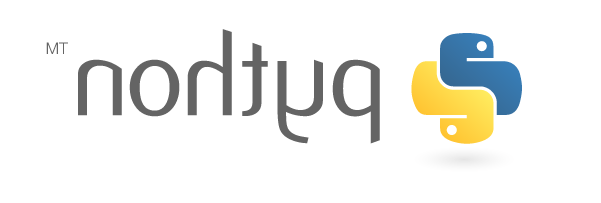

# Manipulation d'images avec Python et stéganographie

Une première partie du projet permet de découvrir le module {{sc("pil")}} permettant de manipuler les images en Python. Ce module (**P**ython **I**maging **L**ibrary) permet notamment d'interagir directement avec les pixels constituants une image. Cette fonctionnalité est utilisée dans la seconde partie du projet afin de dissimuler au sein d'une image une information, c'est ce qu'on appelle la [stéganographie](https://fr.wikipedia.org/wiki/St%C3%A9ganographie){target=_blank}

## Etape 1 : Prise en main de PIL (partie 1)

La prise en main du module {{sc("pil")}} s'effectue via un notebook :

* option 1 : utilisation directe dans Capytale :
{{capytale("74bf-1061961")}}
* option 2 : téléchargement du notebook pour une utilisation locale
{{telecharger("Notebook PIL","../notebook/pil.ipynb")}} 

Pour cette première étape, il faut faire les exercices 1 à 9 du notebook précédent

## Etape 2 : Prise en main de PIL (partie 2)

Terminer le notebook précédent en faisant les exercices 10 à 13. A ce stade du projet, vous devez avoir compris comment :

* lire les informations de couleur d'une image pixel par pixel
* modifier ces informations

## Etape 3 : Retourner une image avec PIL

Ecrire et tester une fonction Python permettant à l'aide de {{sc("pil")}} de créer un "miroir" d'une image. Attention, il ne s'agit pas d'une rotation d'image. A titre d'exemple ci-dessous une image et son "miroir" en dessous, on ne doit pas utiliser une fonction qui existe déjà dans {{sc("pil")}} on doit créer le "miroir" simplement en manipulant les pixels de l'image de départ.

{: .imgcentre}
{: .imgcentre}

## Etape 4 : Stéganographie

## Etape 5 : Dissimuler un message
