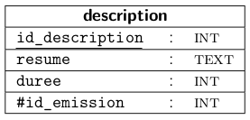

hide: - navigation  in docs.md



{{ corrige_sujetbac(repere_sujet) }}

{{ corrige_exobac(repere_sujet,1) }}
1.  Les attributs de la relations **description** sont :

    * id_description, clé primaire de type entier
    * resume de type text
    * duree de type entier
    * id_emission, clé étrangère de type entier

    C'est en dire en soulignant la clé primaire et en faisant précéder les clés étrangères du caractère # :

    

{{ corrige_exobac(repere_sujet,2) }}

{{ corrige_exobac(repere_sujet,3) }}
