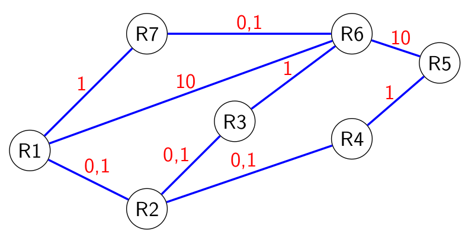

hide: - navigation  in docs.md



{{ corrige_sujetbac(repere_sujet) }}


{{ corrige_exobac(repere_sujet,1) }}


1.  a. Un octet est composé de **8** bits.

    b. On convertit chaque octet en décimal :

    * {{ binaire_dec("11000000")}}
    * {{ binaire_dec("10101000")}}
    * {{ binaire_dec("00000100")}}
    * {{ binaire_dec("11110001")}}

    L'écriture décimal de cette adresse IP est donc `192.168.4.241`.

2.  a. La notation décimale du masque de sous réseau de cette machine est `255.255.255.0` (les 24 premiers octets sont à 1).

    b. L'adresse décimale de ce réseau est `172.20.1.0` (les 8 derniers octets sont à 0).

    c. Sur ce réseau, on peut connecter **254** machines (parmi les 256 adresses possibles, deux sont réservées, l'adresse du réseau et l'adresse de diffusion)

3.  a. Le parcours pouvant être emprunté est {{route(["`R1`","`R6`","`R5`"])}}

    b. Nouvelle table de routage possible pour `R1` :
    
    | Destination | passe par |
    |-------------|-----------|
    | `R3`          |  <code><span class="vert">R2</span></code>      |
    | `R2`          |  `R2`       |
    | `R4`          |  `R2`       |
    | `R5`          |  <code><span class="vert">R7</span></code>       |
    | `R6`          |  <code><span class="vert">R7</span></code>        |
    | `R7`          |  `R7`       |

    !!! note
        Une autre table de routage possible est :

        | Destination | passe par |
        |-------------|-----------|
        | `R3`          |  <code><span class="vert">R2</span></code>      |
        | `R2`          |  `R2`       |
        | `R4`          |  `R2`       |
        | `R5`          |  <code><span class="vert">R2</span></code>       |
        | `R6`          |  <code><span class="vert">R7</span></code>        |
        | `R7`          |  `R7`       |


    c. La nouvelle route sera {{route(["`R1`","`R7`","`R6`","`R5`"])}}

    !!! note
        Avec l'autre table possible donnée en note ci-dessous, la nouvelle route sera : {{route(["`R1`","`R2`","`R4`","`R5`"])}}

4.  a. Tableau complété :

    | Liaison      | Débit | Coût |
    |---------     |-------|------|
    | Ethernet     | $\textcolor{green}{10^7}$|  10    |
    | Fast_Ethernet| $10^8$ | $\textcolor{green}{1}$ |
    | Fibre        | $10^9$ | $0,1$ |

    b. Représentation du réseau :
    {.imgcentre width=500px}

    c. Envoi de `R1` vers `R5`

    | Chemin possible | Coût |
    |-----------------|------|
    |{{route(["`R1`","`R2`","`R4`","`R5`"])}}| $1,2$ |
    |{{route(["`R1`","`R2`","`R3`","`R6`","`R5`"])}}| $11,2$ |
    |{{route(["`R1`","`R6`","`R5`"])}}| $20$ |
    |{{route(["`R1`","`R7`","`R6`","`R5`"])}}| $11,1$ |
    |{{route(["`R1`","`R6`","`R3`","`R2`","`R4`","`R5`"])}}| $12,2$ |
    |{{route(["`R1`","`R7`","`R6`","`R3`","`R2`","`R4`","`R5`"])}}| $3,3$ |

    d. Le chemin le moins coûteux sera donc {{route(["`R1`","`R2`","`R4`","`R5`"])}} pour un coût total de $1,2$.

{{ corrige_exobac(repere_sujet,2) }}

1.  a.  `lait = Aliment(65.1, 3.32, 4.85, 3.63)`

    b.  `lait.energie`

    c.  `lait.proteines = 3.4`

2.  
```python
def energie_reelle(self,masse):
    return masse * self.energie / 100
```

3.  a. `nutrition['lait'].energie`

    b. `nutrition['lait'].energie_reelle(220)` ou sans utiliser la fonction `energie_reelle` : `nutrition['lait'].energie*220/100`

4. 
```python
energie_totale = 0
for ingredient in recette_gateau:
    energie_totale += nutrition[ingredient].energie_reelle(recette_gateau[ingredient])
```

{{ corrige_exobac(repere_sujet,3) }}

1.  a.  La clé étrangère de la relation `musiciens` est `Code_instruments` car c'est la clé primaire d'une autre relation.

    b.  **musiciens**(^^id_mus^^ : INT, Nom : TEXT, Prenom : TEXT, Mail : TEXT, Anciennete : INT, #Code_instrument : INT) <br>
        **instruments**(^^Code_instrument^^ : INT, type_ins : TEXT)

2.  a. Le résultat de cette requête sera :

    | Nom | Prenom |
    |-----|--------|
    |Dupuis|Alice  |
    |Tourelle|Philippe|

    b. Requête permettant d'afficher les noms et prenoms de tous les musiciens membres depuis 5 ans ou plus :
    ```sql
    SELECT Nom, Prenom 
    FROM musiciens
    WHERE anciennete >= 5 ;
    ```

3.  a.  
    ```sql
    UPDATE musiciens
    SET Mail = "tour.char@mail.fr"
    WHERE id_mus = 5 ;
    ```

    b. 
    ```sql
    SELECT Nom, Prenom
    FROM musiciens
    JOIN instruments ON musiciens.Code_instrument = instruments.Code_instrument
    WHERE instruments.type_inst = "Violon" ;
    ```

    c.
    ```sql
    INSERT INTO Admin
    VALUES ("Trésorier",2,1)
    ```

    !!! note
        Le sujet indique que le poste de "`Trésorier`" vient d'être créé, on a donc indiqué la valeur 1 pour le champ `Anciennete_poste`
    
    d.
    ```sql
    SELECT type_ins 
    FROM instruments
    JOIN musiciens ON musiciens.id_mus = instruments.id_mus
    JOIN Admin ON Admin.id_mus = musiciens.id_mus
    WHERE Poste = "Président" ;
    ```


