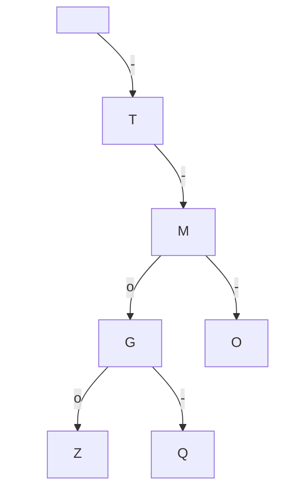
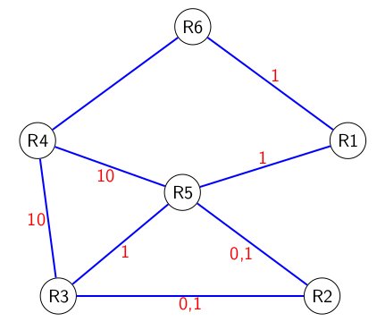

hide: - navigation  in docs.md



{{ corrige_sujetbac(repere_sujet) }}


{{ corrige_exobac(repere_sujet,1) }}

1.  En suivant l'arbre comme indiqué dans l'énoncé, on trouve :

    * le code de la lettre `N` est `-o`
    * le code de la lettre `S` est `ooo`
    * le code de la lettre `I` est `oo`

    Donc, le code morse de `NSI` est `-o ooo oo`

2. Représentation du sous arbre pour les lettres `G`, `M`, `O`, `Q`, `Z` :

3. La lettre `S` est le fils gauche de `I` (`arbre.gauche.gauche`) et la lettre `K` le fils droit de `N` (`arbre.droite.gauche`), donc les instructions sont :
```python3
arbre.gauche.gauche.gauche = Noeud("S")
arbre.droite.gauche.droit = Noeud("K")
```
4.  a.  
    ```python3 linenums="1" hl_lines="2 4 7"
    def est_present(n, car) : 
        if n == None : #(1)
            return False
        elif n.valeur == car : #(2)
            return True
        else :
            return est_present(n.droite, car) or est_present(n.gauche, car) #(3)
    ```

    1. Si le noeud est `None` alors le caractère n'est pas présent
    2. On renvoie `True` si la valeur du noeud est le caractère cherché
    3. On relance récursivement la recherche dans les deux sous arbres (droit et gauche)

    b. La fonction `est_present` est récursive car elle s'appelle elle-même.

    c. Cette fonction parcourt en profondeur et la racine puis chacun des deux sous arbres, c'est donc un parcours en *profondeur prefixe*.

5.  a.
    ```python linenums="8" hl_lines="3 4 7"
    def code_morse(n, car):
        if n.valeur == car :
            return "" #(1)
        elif est_present(n.droit,car) : #(2)
            return "-" + code_morse(n.droite, car)
        else :
            return "o" + code_morse(n.gauche, car) #(3)
    ```

    1. On a atteint le caractère, son code a déjà été constitué entièrement, on renvoie `""`
    2. Le caractère est à droite on ajoute `"-"` *devant* le code et on relance la recursion
    3. Même traitement mais à gauche (on ajoute `"o"`)

    b.      
    ```python3
    def morse_message(arbre,message):
        message_code = ""
        for car in message:
            message_code = message_code + code_morse(arbre,car) + "|"
        return message_code
    ```

    !!! note
        Dans la fonction ci-dessus, un `"|"` figure toujours à la fin d'un message non vide.

{{ corrige_exobac(repere_sujet,2) }}

1. L'écriture binaire de cette adresse est : `{{get_bin((192))}}.{{get_bin((168))}}.{{get_bin((162))}}.{{get_bin((4))}}`

2.  a. L'adresse du réseau local du secteur "Administration" est `192.168.16.0` (tous les bits de la partie hôte sont à 0) et son masque de sous réseau `255.255.255.0` (les 24 premiers bits sont à 1)

    b. L'adresse de diffusion est `192.168.16.255` (tous les bits de la partie hôte sont à 1)

    c. On peut connecter **254** machines à ce réseau

3.  Table de routage de `R5` :

    | Destination | Passe par | Distance |
    |-------------|-----------|----------|
    | `R1`        | `R1`      | 1        |
    | `R2`        | `R2`      | 1        |
    | `R3`        | `R3`      | 1        |
    | `R4`        | `R4`      | 1        |
    | `R6`        | `R1`      | 2        |

    Table de routage de `R6` :

    | Destination | Passe par | Distance |
    |-------------|-----------|----------|
    | `R1`        | `R1`      | 1        |
    | `R2`        | `R1`      | 3        |
    | `R3`        | `R4`      | 2        |
    | `R4`        | `R4`      | 1        |
    | `R6`        | `R1`      | 2        |

    !!! note
        Plusieurs tables sont possibles, le sujet devrait l'indiquer !

    b. Le chemin emprunté sera : {{route(["`R6`","`R4`","`R3`"])}}

    c. La nouvelle route sera : {{route(["`R6`","`R1`","`R5`","`R3`"])}}

4.  a. Tableau complété : 

    | Liaison      | Débit | Coût |
    |---------     |-------|------|
    | Ethernet     | $\textcolor{green}{10^7}$|  10    |
    | Fast_Ethernet| $10^8$ | $\textcolor{green}{1}$ |
    | Fibre        | $10^9$ | $\textcolor{green}{0,1}$ |

    b. Schéma avec le coût des liaisons :

    {.imgcentre width=500px}

    c. Le coût de la route {{route(["`R4`","`R5`","`R2`"])}} est $10,1$ donc le coût de la liaison {{route(["`R6`","`R4`"])}} est 1, c'est une liaison Fast-Ethernet.

    d. La route sera {{route(["`R6`","`R1`","`R5`","`R2`"])}} pour un coût total de $2,1$.


{{ corrige_exobac(repere_sujet,3) }}

1.  a. Cette requête renvoie les `id_vehicule` des véhicules de type `'citadine'`, sur l'extrait présenté on obtient donc :

    | id_vehicule |
    |-------------|
    | 1 |
    | 2 |
    | 4 |

    b. 
    ```sql
    SELECT immatriculation
    FROM vehicule
    WHERE carburant = "diesel" ;
    ```

    c. Le résultat de cette requête sera :
        
    | immatriculation | modele |
    |-----------------|--------|
    | ML – 128 – VM   | C3     |
    | CL – 142 – CE   | C5     |
    | AB – 135 – YZ   | 208    |
    | JL – 526 – LM   | 508    |
    | EC – 246 – TP   | Zoe    |
    | LC – 231 – MG   | Model X|

    d.
    ```sql
    SELECT COUNT(*)
    FROM vehicule ;
    ```

    e.
    ```sql
    SELECT nom, prenom
    FROM utilisateur
    ORDER BY nom ASC;
    ```

    !!! note
        Le `ASC` est optionnel puisque c'est l'ordre croissant est l'ordre par défaut

2.  a. Les clés étrangères sont les clés primaires d'une autre table, ici c'est donc : `id_utilisateur` qui référence l'utilisateur et `id_vehicule` qui référence le véhicule loué.

    b. **vehicule** (^^id_vehicule^^, immatriculation, marque, modele, type, carburant) <br>
    **utilisateur** (^^id_utilisateur^^, nom, prenom, permis, adresse, ville) <br>
    **location** (^^id_location^^, #id_utilisateur, #id_vehicule, date_debut, date_fin)

    c. Les clés primaires doivent être uniques, or ici la valeur 1 existe déjà pour la clé primaire `id_location`, un nouvel enregistrement ayant cette même valeur ne peut donc pas être ajouté.

3.  a.
    ```sql
    UPDATE utilisateur
    SET adresse = "50 rue de la Liberté"
    WHERE id_utilisateur = 133 ;
    ```

    b. 
    ```sql
    INSERT INTO utilisateur
    VALUES (137, "LEFEBVRE", "Gabriel", 124689, "30 ruelle des champs", "Amiens") ;
    ```

    c.
    ```sql
    INSERT INTO location
    VALUES (4, 132, 3, "2022-06-21", "2022-06-23") ;
    ```

    d.
    ```sql
    SELECT vehicule.modele, vehicule.immatriculation, utilisateur.nom, utilisateur.prenom
    FROM vehicule
    JOIN location ON location.id_vehicule = vehicule.id_vehicule
    JOIN utilisateur ON utilisateur.id_utilisateur = location.id_utilisateur
    WHERE location.date_debut = "2022-06-21"
    ```
    


