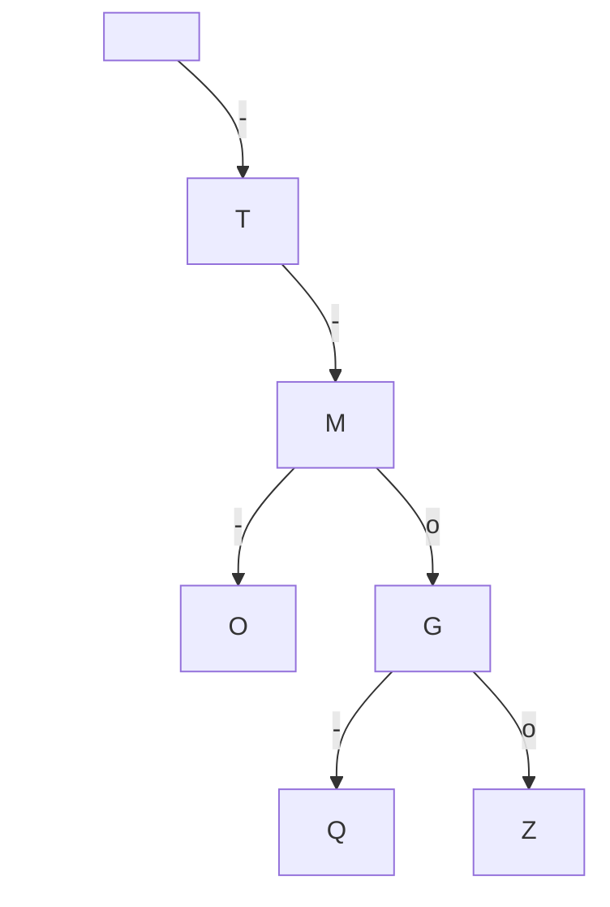

hide: - navigation  in docs.md



{{ corrige_sujetbac(repere_sujet) }}

{{ corrige_exobac(repere_sujet,1) }}

1.  En suivant l'arbre comme indiqué dans l'énoncé, on trouve :

    * le code de la lettre `N` est `-o`
    * le code de la lettre `S` est `ooo`
    * le code de la lettre `I` est `oo`

    Donc, le code morse de `NSI` est `-o ooo oo`

2. Représentation du sous arbre pour les lettres `G`, `M`, `O`, `Q`, `Z` :

3. 

{{ corrige_exobac(repere_sujet,2) }}

{{ corrige_exobac(repere_sujet,3) }}
