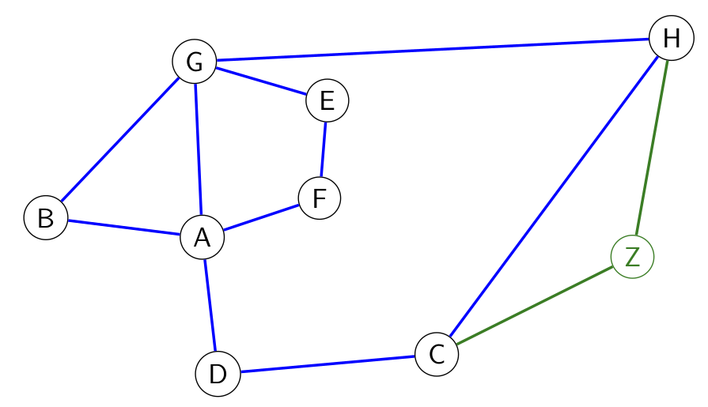

hide: - navigation  in docs.md



{{ corrige_sujetbac(repere_sujet) }}


{{ corrige_exobac(repere_sujet,1) }}

1. 
    * Table de routage du noeud  `B`

    | Destination | Coût |
    |-------------|------|
    | A           | 1    |
    | C           | 3    |
    | D           | 2    |
    | E           | 2    |
    | F           | 2    |
    | G           | 1    |
    | H           | 2    |

    * Table de routage du noeud `F`

    | Destination | Coût |
    |-------------|------|
    | A           | 1    |
    | B           | 2    |
    | C           | 3    |
    | D           | 2    |
    | E           | 1    |
    | G           | 2    |
    | H           | 3    |


2. Le protocole RIP minimise le nombre de routeurs traversé, ici pour aller du noeud `F` au noeud `H`, au minmum on traverse 3 routeurs et les routes possibles sont :
    * {{route(["`F`","`E`","`G`","`H`"])}} 
    * {{route(["`F`","`A`","`G`","`H`"])}}

3. D'après sa table de routage, le nouveau noeud `Z` se situe à 1 saut de `C` et de `H`. Ci-dessous le tracé le réseau avec le nouveau noeud en vert :
{.imgcentre width=500px}

4. Le protocole OSPF minimise le coût du chemin traversé, ici ce sera donc la route {{route(["`B`","`G`","`E`","`F`","`A`","`D`","`C`","`H`"])}} pour un coût total de **34**.


{{ corrige_exobac(repere_sujet,2) }}

!!! bug 
    Attention, une erreur figure dans le sujet à propos de la relation `Equipe`, contrairement à ce qui est indiqué `id_vol` n'est pas la clé primaire de cette relation. La clé primaire de cette relation est formée du couple `(id_vol,id_astronaute)`. L'attribut `id_vol` est une clé étrangère faisant référence à lattribut `id_vol` de la relation `Vol`.

1.  a. Une clé primaire permet d'identifier de façon unique un enregistrement d'une table.

    b. Cette requête tente d'insérer dans la table un nouvel enregistrement dont la clé primaire `id_astronaute` est 3. Or la clé primaire doit être unique et il existe déjà dans la table `Astronaute` un enregistrement dont l'`id_astronaute` est 3. Cette requête provoque donc une erreur.

    c. **Fusee** (^^id_fusee^^ : {{sc("int")}}, modele :  {{sc("text")}}, constructeur : {{sc("text")}}, nb_places :  {{sc("int")}})

2.  a. Cette requête renvoie le nombre de fusées dont le constructeur est `'SpaceX'`, elle renvoie donc **2**.

    b.
    ```sql
    SELECT modele, constructeur
    FROM Fusee
    WHERE nb_places >=4 ;
    ```

    c.
    ```sql
    SELECT nom, prenom
    FROM Astronaute
    ORDER BY nom ASC;
    ```

    !!! note
        On rappelle que l'ordre de tri par défaut est l'ordre croissant, le `ASC` est donc optionnel.


3.  a.
    ```sql
    INSERT INTO Vol
    VALUES (5,3, "12/04/2023");

    INSERT INTO Equipe
    VALUES (5,1);

    INSERT INTO Equipe
    VALUES (5,4);
    ```

    b.
    ```sql
    SELECT nom, prenom
    FROM Astronaute
    JOIN Equipe ON Astronaute.id_astronaute = Equipe.id_astronaute
    JOIN Vol ON Equipe.id_vol = Vol.id_vol
    WHERE Vol.Date = "25/10/2022"
    ```

{{ corrige_exobac(repere_sujet,3) }}

1. 
    * La taille de cet arbre est **5** (son nombre de noeud)
    * La hauteur de cet arbre est **3** (longueur du plus long chemin de la racine vers une feuille)

2. 
    * L'insertion de `'davidbg'` se fait à gauche de `'dfifi'` puis à droite de `'annieji'` et enfin à droite de `'celine'`
    * L'insertion de `'papicoeur'` se fait à droite de `'dfifi'`puis à droite de `'helene'`
    L'arbre arbre insertion de ces deux valeurs est donc :
    ```mermaid
        graph TD
        A["'dfifi'"] --> B["'annieji'"]
        A --> C["'helene'"]
        B --> D["'aalice'"]
        B --> E["'celine'"]
        C --- V1[" "]
        C --> F["'papicoeur'"]
        E --- V2[" "]
        E --> G["'davidbg'"]
        style V1 fill:#FFFFFF, stroke:#FFFFFF
        linkStyle 4 stroke:#FFFFFF,stroke-width:0px
        style V2 fill:#FFFFFF, stroke:#FFFFFF
        linkStyle 6 stroke:#FFFFFF,stroke-width:0px
        linkStyle 7 stroke:#FF0000,stroke-width:2px
        linkStyle 5 stroke:#FF0000,stroke-width:2px
        style G fill:#FFCCCC, stroke:#FF0000
        style F fill:#FFCCCC, stroke:#FF0000
    ```

3. Le parcours à utiliser est le **C** (parcours en profondeur infixe)

4. 
```python linenums="1" hl_lines="5 7 9"
def present(self, identifiant):
    if self.est_vide():
        return False
    elif self.racine() == identifiant:
        return True #(1)
    elif self.racine() < identifiant:
        return self.sd().present(identifiant) #(2)
    else:
        return self.sg.present(identifiant) #(3)
```

    1. L'identifiant cherché est la racine, on renvoie `True`
    2. On relance récursivement la recherche à droite car l'étiquette de la racine est inférieure à celle recherchée
    3. On relance récursivement la recherche à gauche

    !!! bug
        Le code précédent est probablement la réponse attendue, mais il ne fonctionne **pas** en l'état. En effet l'énoncé indique que `self.sg()` (ou `self.sd()`) renvoie `None` lorsque le sous arbre n'existe pas. Cela conduit donc à relancer la recherche sur `None` or la méthode ̀`present` n'est pas définie pour `None`.

5.  a. `est_vide(f1)` renvoie `False`

    b. {{file(["'bac'","'nsi'","'2023'"])}}

    c. {{file(["'poule'","'python'","'castor'"])}}

    !!! note
        Lors du parcours de la liste c'est `'castor'` qui est enfilé en premier puis `'python'` et enfin `'poule'`

6. 
```python linenums="1" hl_lines="4 6 7"
def longueur(f):
    resultat = 0
    g = creer_file()
    while not est_vide(f) : #(1)
        elt = defiler(f)
        resultat = resultat + 1 #(2)
        enfiler(g , elt) #(3)
    while not(est_vide(g)):
        enfiler(f, defiler(g))
    return resultat
```

    1. Tant que `f` n'est pas vide
    2. On a défilé un élement de f, on incrémente le compteur
    3. On sauvegarde l'élément dans une file `g`. De façon à pouvoir restituer `f` dans son état d'origine on enfilera (boucle suivante) tous les éléments de `g` dans `f`.

7. C'est `'2!@59fgds'` qui sera validé en effet `'best@'` est rejeté car contient moins de 8 caractères et `'paptap23'` est rejeté car ne contient aucun des caractères de la liste `['!', '#', '@', ';', ':']`.

8. 
```python
def ajouter_mot(f,mdp):
    if longueur(f) == 3:
        defiler(f)
    enfiler(f,mdp)
```

    !!! note
        Par hypothèse `f` contient au plus 3 éléments, donc on défile seulement dans le cas ou sa longueur est 3.

9. 
```python linenums="1" hl_lines="7 8"
def mot_file(f, mdp):
    g = creer_file()
    present = False
    while not(est_vide(f)):
        elt = defiler(f)
        enfiler(g, elt)
        if elt == mdp: #(1)
            present = True #(2)
    while not(est_vide(g)):
        enfiler(f, defiler(g))
    return present
```

    1. On a trouvé le mot de passe dans la file
    2. On met à jour le booléen `present`

10. 
```python
def modification(f,nv_mdp):
    if est_valide(nv_mdp) and not mot_file(f,nv_mdp):
        ajouter_mot(f,nv_mdp)
        return True
    return False
```
