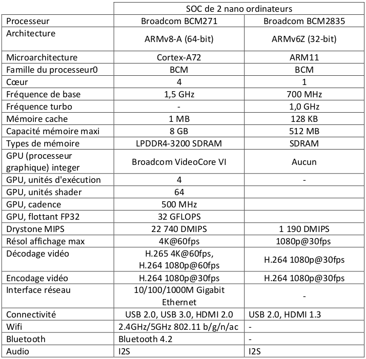





{{ titre_chapitre(num,titre,theme,niveau)}}
 
## Activités 

{{ titre_activite("Révisions",[],0) }}
* Télécharger le [cours de première sur l'architecture des ordinateurs](https://fabricenativel.github.io/Premiere/pdf/C4/C4-cours.pdf) pour revoir le modèle de Von Neumann.
* Tester vos connaissances en :
    * répondant aux [QCM](https://fabricenativel.github.io/Premiere/architecture/#qcm){target=_blank} du chapitre de première (les cinq premières questions)
    * Faisant [l'exercice 2 du chapitre du chapitre de première](https://fabricenativel.github.io/Premiere/architecture/#exercice-2-modele-de-von-neumann){target=_blank}

{{ titre_activite("Système sur puces",[])}}
En faisant vos propres recherches sur le *Web*, ou en utilisant les ressources suivantes :

* [Le site Pixee](https://pixees.fr/informatiquelycee/n_site/nsi_term_archi_soc.html){target=_blank}
* [Mon lycée numérique](https://monlyceenumerique.fr/nsi_terminale/arse/a1_systeme_%20sur%20_puce.html){target=_blank}
* [qkzk](https://qkzk.xyz/docs/nsi/cours_terminale/architecture/composants/cours/){target=_blank}

Répondre aux questions suivantes : 

1. Qu'est-ce qu'un *Système sur puces* (*SoC* pour *System on Chip* en anglais)?
2. Quels sont les avantages d'un *Soc* ?
3. Quels sont les inconvénients d'un *SoC* ?

## Cours

{{ aff_cours(num) }}

## Exercices

{{ exo("Comparaison de deux SoC",["bac"],0 )}}

Un nano ordinateur est un ordinateur possédant une taille inférieure à un micro-ordinateur. Les nano ordinateurs (sans l'alimentation, le clavier, la souris et l'écran) tiennent dans la paume de la main. Le Soc (*system on chip*), littéralement un système sur une puce, est un système complet embarqué sur une seule puce (circuit intégré) pouvant comporter de la mémoire, un ou plusieurs microprocesseurs, des périphériques d'interface, ou tout autre composant. On souhaite comparer les performances de deux nano-ordinateurs contenant chacun un SOC différent dont les
caractéristiques sont détaillées ci-dessous:

{.imgcentre width=600px}

1. Expliquer ce qui différencie un *SoC* d'un nano ordinateur d'un microprocesseur classique.
2. Lequel de ces *Soc* peut être connecté à un réseau filaire ? Justifier la réponse
3. Citer deux caractéristiques permettant de comparer la puissance de calcul de ces deux *Soc*.

